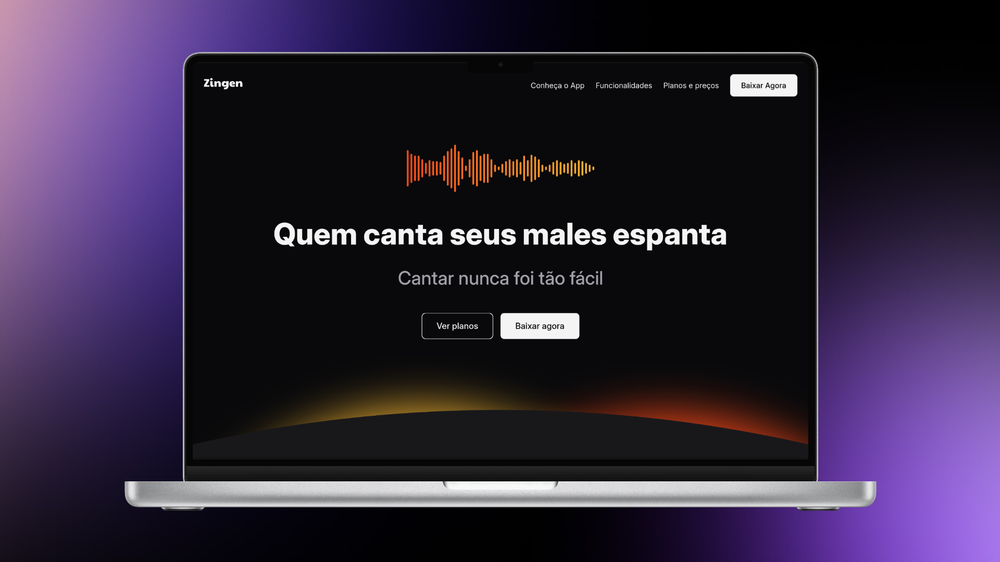

# Zigen - Landing Page para Aplicativo de Karaokê

 <!-- Adicione uma imagem de preview -->

Landing Page responsiva para o aplicativo Zigen - Sua plataforma completa para prática e melhoria de habilidades vocais através de Karaokê inteligente.

# 📝 Descrição

# Projeto desenvolvido como parte da formação Full-stack, com o objetivo de colocar em prática os seguintes conceitos:
- HTML semântico e acessível
- CSS moderno com Flexbox e Grid
- Design Responsivo (Mobile First)
- Facilitando a manutenção e uso de css através de utilities css
- Otimização de assets e performance
- Boas práticas de organização de código

# 🛠 Tecnologias Utilizadas

- **Frontend**
  - HTML5 semântico
  - CSS3 moderno (Variáveis, Grid, Flexbox)
  - Metodologia BEM para CSS
  - Design Responsivo (Mobile First)

- **Ferramentas**
  - Google Fonts (Inter)
  - SVG para ícones e ilustrações
  - Otimização de imagens

# 🎯 Objetivos de Aprendizado

## Este projeto teve como foco principal a prática de:
- 1. Estruturação semântica de HTML
- 2. Técnicas avançadas de posicionamento CSS
- 3. Implementação de layouts complexos com Grid e Flexbox
- 4. Criação de componentes reutilizáveis
- 5. Técnicas de responsividade e adaptação cross-browser
- 6. Organização de arquivos e assets
- 7. Boas práticas de acessibilidade (ARIA labels, alt texts)

